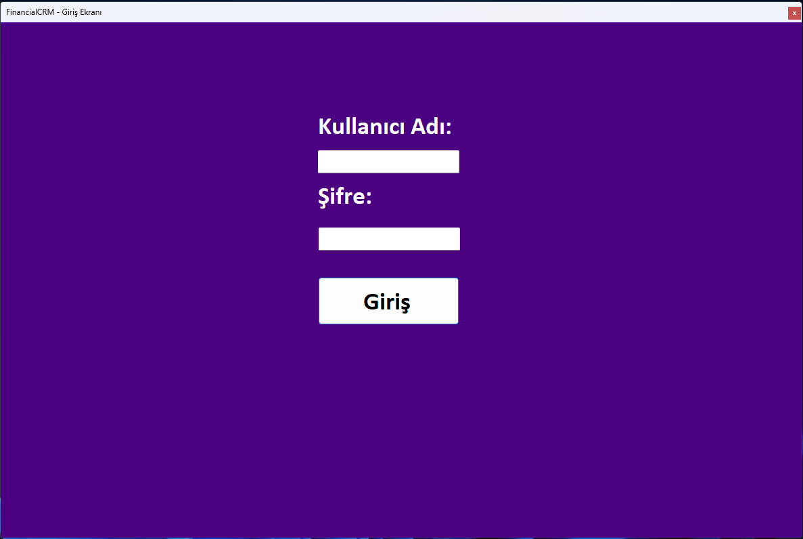
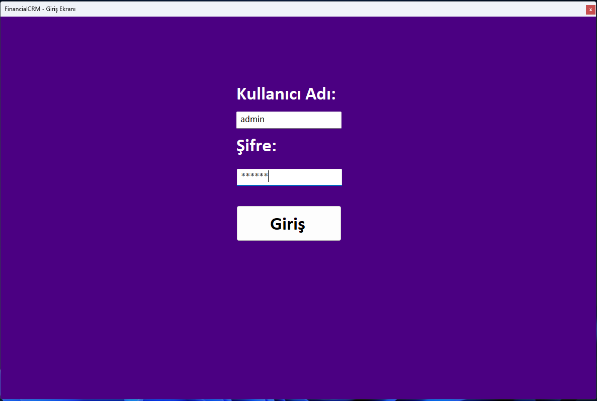
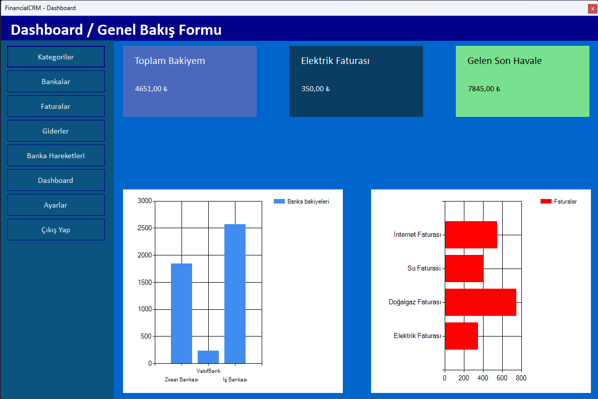
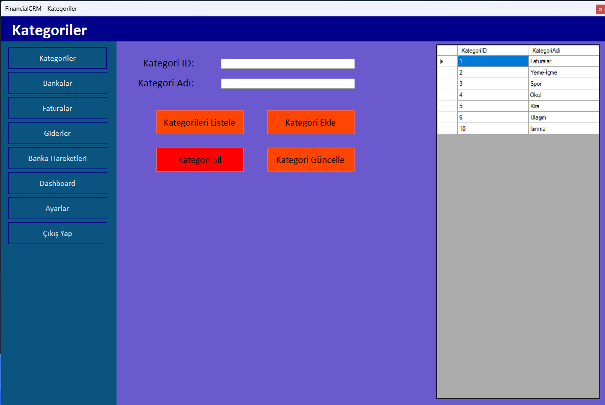
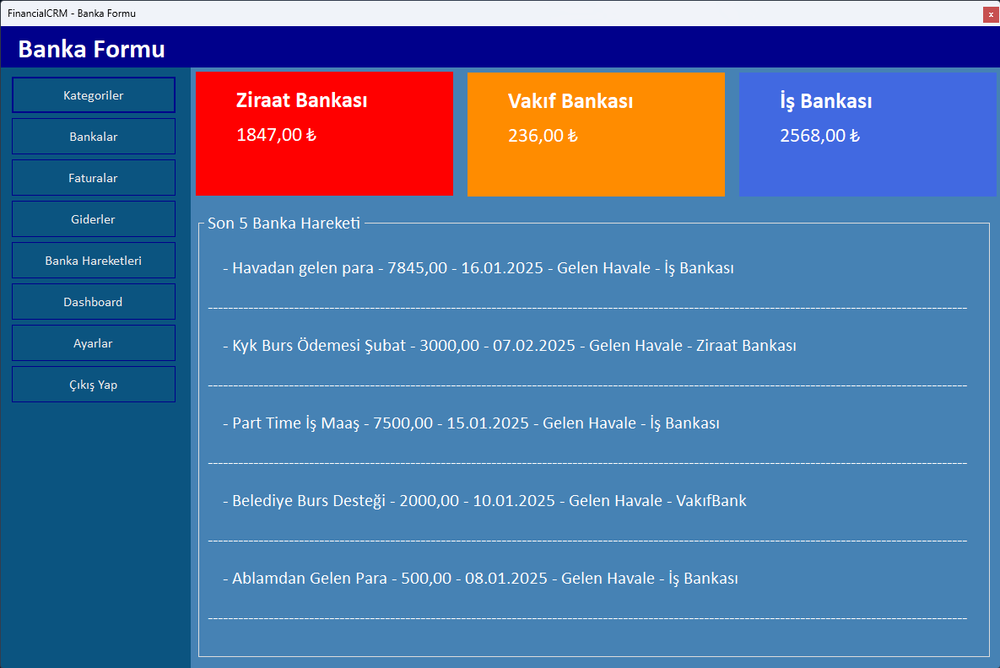
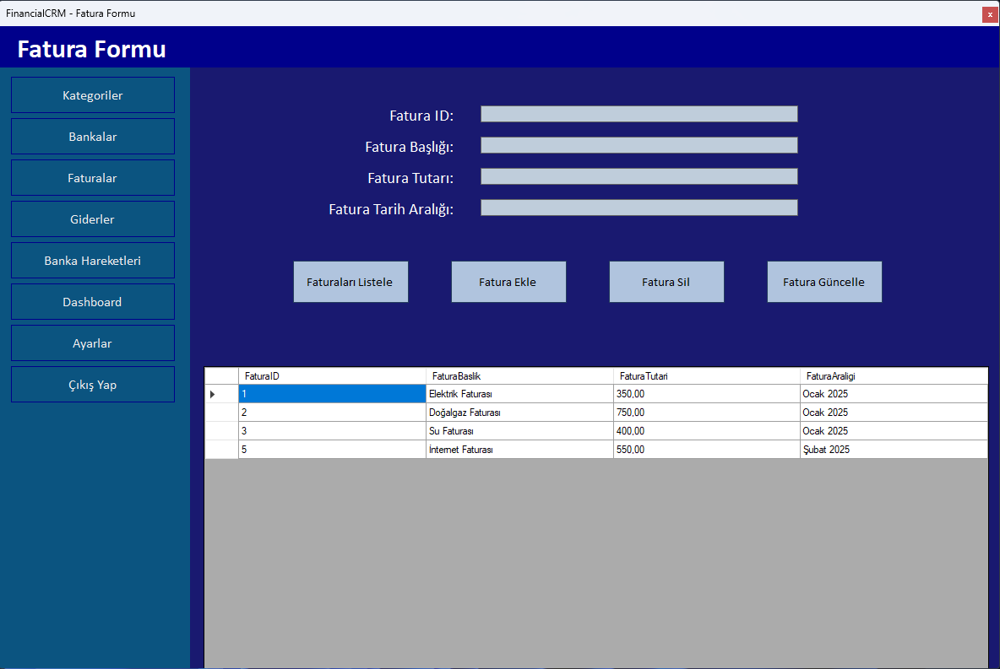
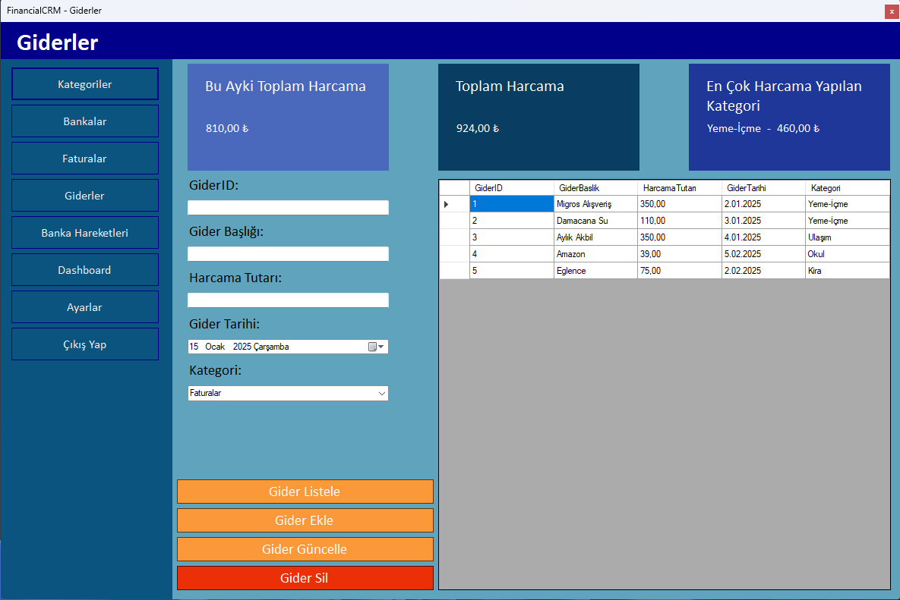
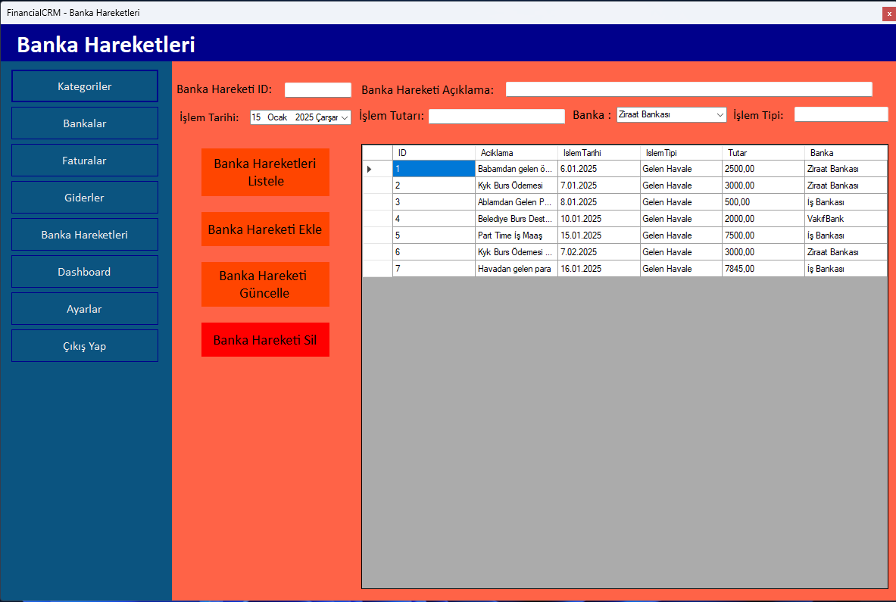
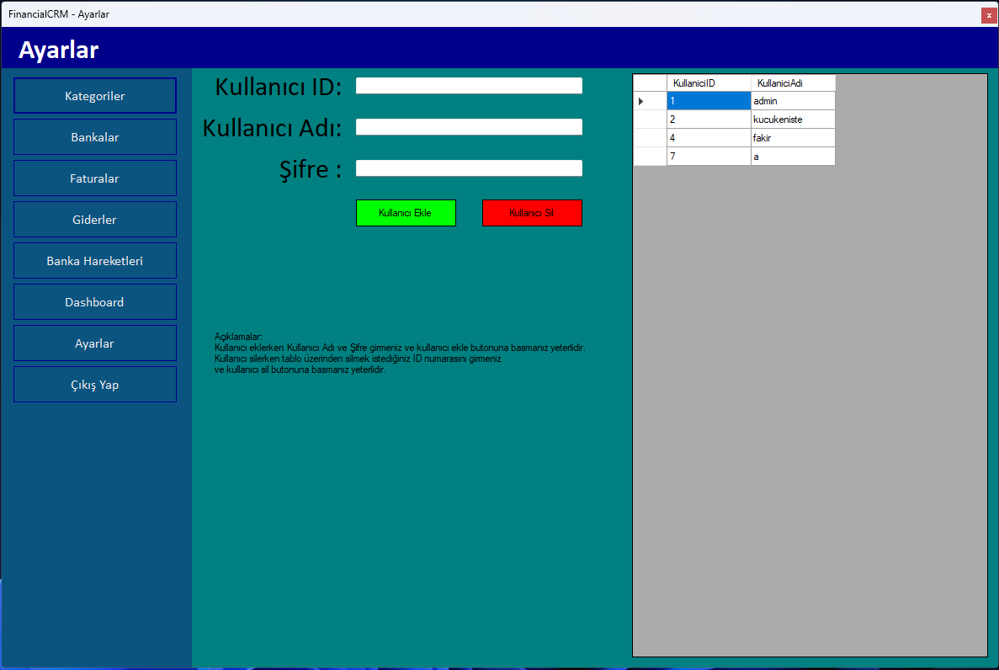

# FinancialCrm       


---

Murat YÜCEDAĞ [C# Eğitim Kampı](https://www.youtube.com/playlist?list=PLKnjBHu2xXNPmFMvGKVHA_ijjrgUyNIXr)     
Check original repository => [C# Eğitim Kampı Original Repository](https://github.com/MuratYucedag/CSharpEgitimKampi)    
Check original repository => [C# Eğitim Kampı Original Repository - Part 2](https://github.com/MuratYucedag/CSharpEgitimKampi301)    
Check original repository => [C# Eğitim Kampı Original Repository - Part 3](https://github.com/MuratYucedag/CSharpEgitimKampi501)    
Check original repository => [C# Eğitim Kampı Original Repository - Part 4](https://github.com/MuratYucedag/CSharpEgitimKampi601)    
Check original repository => [C# Eğitim Kampı Original Repository - Part 5](https://github.com/MuratYucedag/MyFinancialCrm)    

---        

## Kaynaklar   
[Microsoft Şifreleme Çözümleri](https://learn.microsoft.com/en-us/dotnet/standard/security/cryptography-model)

## Görseller











## Dersler
### Module Financial CRM - Completed    
---    

### :green_circle: Ders 28 - Proje: Finansal Crm Uygulaması 1    
Tasarım ile giriş yaptık. Veritabanı üzerinde verilerilerimizi oluşturduk ve uygulama tasarımımızı yaptık.
Veritabanı ile proje arasındaki bağlantımızı Entity Framework 6.0 olarak ekledik. 

MSSQL için oluşturulmuştur. Diğer Veritabanları için farklı bir sql komutu gerekebilir!    

FinancialCrmDb adlı veritabanını oluşturur.    
```sql 
CREATE DATABASE FinancialCrmDb
```    

FinancialCrmDb içerisine Categories adlı tabloyu oluşturur.     
```sql 
CREATE TABLE FinancialCrmDb.dbo.Categories(
CategoryId int IDENTITY(1,1) NOT NULL PRIMARY KEY,
CategoryName nvarchar(50),
);
```    

Categories tablosuna veri girişi sağlar.    
```sql 
INSERT INTO FinancialCrmDb.dbo.Categories 
(
CategoryName
)
VALUES
('Faturalar'),
('Yeme-İçme'),
('Spor'),
('Okul'),
('Kira'),
('Ulaşım');
```     

FinancialCrmDb içerisine Banks adlı tabloyu oluşturur.   
```sql 
CREATE TABLE FinancialCrmDb.dbo.Banks(
BankId int IDENTITY(1,1) NOT NULL PRIMARY KEY,
BankAccountNumber nvarchar(50),
BankTitle nvarchar(50),
BankBalance decimal(18, 2)
);
```     

Banks tablosuna veri girişi sağlar.     
```sql 
INSERT INTO FinancialCrmDb.dbo.Banks
(BankAccountNumber,BankTitle,BankBalance)
VALUES
('0000-1234-0022-0044','Ziraat Bankası','1847.00'),
('0000-1234-0022-0046','VakıfBank','236.00'),
('0000-1234-0022-0054','İş Bankası','2568.00');
```      

FinancialCrmDb içerisine Bills adlı tabloyu oluşturur.     
```sql 
CREATE TABLE FinancialCrmDb.dbo.Bills(
BillId int IDENTITY(1,1) NOT NULL PRIMARY KEY,
BillTitle nvarchar(50),
BillAmount decimal(18 ,2),
BillPeriod nvarchar(50)
);
```     

Bills tablosuna veri girişi sağlar.     
```sql
INSERT INTO FinancialCrmDb.dbo.Bills
(BillTitle,BillAmount,BillPeriod)
VALUES
('Elektrik Faturası','350.00','Ocak 2025'),
('Doğalgaz Faturası','750.00','Ocak 2025'),
('Su Faturası','400.00','Ocak 2025'),
('İnternet Faturası','700','Şubat 2025');
```     

FinancialCrmDb içerisine Users adlı tabloyu oluşturur.   
Burada şifre işlemini gerçek hayata uyarlamak için fazladan salt ekliyoruz.Ve password kısmını HashedPassword olarak tutacağız.     
```sql 
CREATE TABLE FinancialCrmDb.dbo.Users(
UserId int IDENTITY(1,1) NOT NULL PRIMARY KEY,
UserName nvarchar(50),
HashedPassword nvarchar(200),
Salt nvarchar(200)
);
```      

Users tablosuna veri girişi sağlar.(Aşırı güvenli oldu. :rofl: )     
     
Kullanıcı Adı - Şifre      
admin - 123456      
    
Şifreler önce Şifreleme kütüphanesi ile şifrelendikten sonra       
Base64 ile encode edilerek saklanır. Geri işlem yapılırken      
Base64 ile decode edilir ve sonra şifreleme kütüphanesi ile şifre çözülür.      
        
Basitçe Yeni Kayıtta       
1- Şifreyi al.      
2- Şifreyi rastgele salt değeri ile şifreleme algoritması ile şifrele.          
3- Şifrelenmiş şifreyi ve salt değerini base64 olarak veritabanına sakla.       
      
Basitçe kontrol      
1- Şifreyi al.      
2- Veritabanından salt değerini al ve base64 ile decode(çöz) et.      
3- Alınan şifreyi aynı salt değeri ile tekrar şifrele.      
4- Veri tabanına kaydedilen önceki şifrelenmiş şifre ile yeni şifrelenmiş şifre aynı mı kontrol et.     
5- Aynı ise girişi sağla.      
```sql 
INSERT INTO FinancialCrmDb.dbo.Users
(UserName,HashedPassword,Salt)
VALUES
('admin','JACs4S/mFg4JmzRiMRnev6pen0ZVqukWsh0HY6HTEbss6fxn99G+WL41/GpTMqpd2sHXUmwjp4ArOhwPIopo4Q==','gDAml0zpFDOKndRkuByeLc9LERGRcH+7AwVvVKD0bqI=');
```     

FinancialCrmDb içerisine BankProcess adlı tabloyu oluşturur.     
```sql 
CREATE TABLE FinancialCrmDb.dbo.BankProcess(
BankProcessId int IDENTITY(1,1) NOT NULL PRIMARY KEY,
Description nvarchar(50),
ProcessDate date,
ProcessType nvarchar(50),
Amount decimal(18, 2),
BankId int
);
```     

BankProcess tablosuna veri girişi sağlar.     
```sql 
INSERT INTO FinancialCrmDb.dbo.BankProcess
(Description,ProcessDate,ProcessType,Amount,BankId)
VALUES
('Babamdan gelen ödeme','2025-01-06','Gelen Havale','2500.00','1'),
('Kyk Burs Ödemesi','2025-01-07','Gelen Havale','3000.00','1'),
('Ablamdan Gelen Para','2025-01-08','Gelen Havale','500.00','3'),
('Belediye Burs Desteği','2025-01-10','Gelen Havale','2000.00','2'),
('Part Time İş Maaş','2025-01-15','Gelen Havale','7500.00','3'),
('Kyk Burs Ödemesi Şubat','2025-02-07','Gelen Havale','3000.00','1'),
('Havadan gelen para','2025-01-16','Gelen Havale','7845.00','3')
;
```       
        
FinancialCrmDb içerisine Spendings adlı tabloyu oluşturur.      
```sql 
CREATE TABLE FinancialCrmDb.dbo.Spendings(
SpendingId int IDENTITY(1,1) NOT NULL PRIMARY KEY,
SpendingTitle nvarchar(250),
SpendingAmount decimal(18, 2),
SpendingDate date,
CategoryId int
);
```      

Spendings tablosuna veri girişi sağlar.     
```sql 
INSERT INTO FinancialCrmDb.dbo.Spendings
(SpendingTitle,SpendingAmount,SpendingDate,CategoryId)
VALUES
('Migros Alışveriş','350.00','2025-01-02','2'),
('Damacana Su','110.00','2025-01-03','2'),
('Aylık Akbil','350.00','2025-01-04','6'),
('Amazon','39.00','2025-02-05','1'),
('Eglence','75.00','2025-02-02','1')
;
```        

Tablolar oluştuktan sonra diagram üzerinde iki bağlantı yapmayı unutmuyoruz.     

Banks tablosunun BankId'sini tutup BankProcess tablosunda yer alan en alttaki BankId'si üzerine bırakıyoruz.        
Categories tablosunun CategoryId'sini tutup Spendings tablosunda yer alan en alttaki CategoryId'si üzerine bırakıyoruz.       
Çıkan sorulara tamam veya evet diyerek Foreign key oluşumunu tablo üzerinden sağlamış oluyoruz.

VS Code üzerinden projeye ado.net entity data model olarak oluşturduğumuz veritabanını ekliyoruz ve 
Bankalar formunu yaparak bu dersimizi tamamladık.


### :green_circle: Ders 29 - Proje: Finansal Crm Uygulaması 2    
Fatura formu uygulamamızı tamamladık. 

### :green_circle: Ders 30 - Proje: Finansal Crm Uygulaması Final Dersi     
Kontrol paneli(dashboard) tasarımı üzerinde durduk. Timer ve chart kullanımlarını öğrendim.  